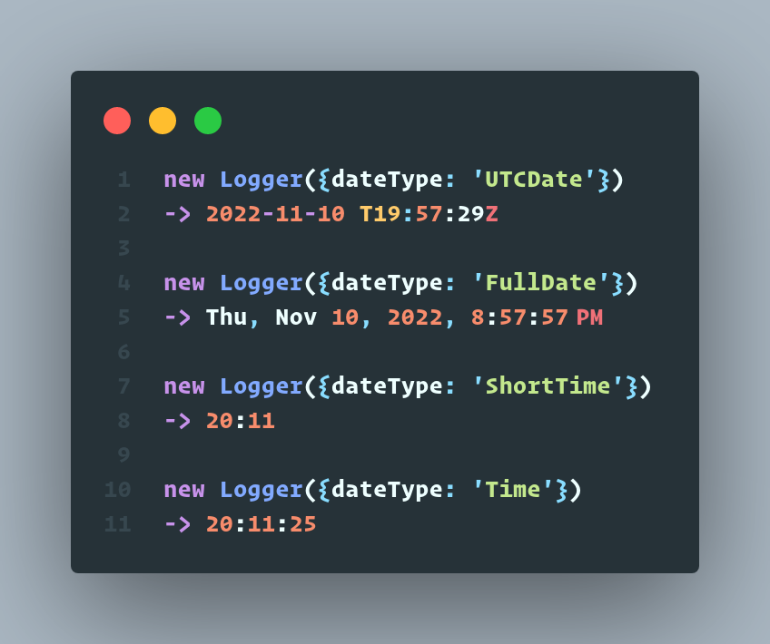
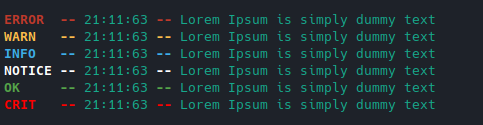
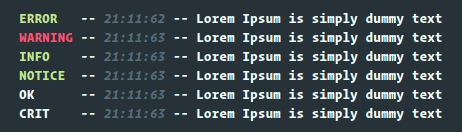

<div align="center">
<h1>ts-dev-logger</h1>

<p>A development tool that allows you to log data to the console and to the file.</p>

<p>
    <a href="#installation"><strong>Installation</strong></a> ·
    <a href="#logger---params"><strong>Params</strong></a> ·
    <a href="#quick-guide---console"><strong>Quick Guide</strong></a> ·
    <a href="#license"><strong>License</strong></a>
 </p>
 
 </br>

[![Package Version][package-image]][package-url]


[package-image]: https://badge.fury.io/js/typescript-template.svg
[package-url]: https://www.npmjs.com/package/ts-dev-logger
</div>

## Installation
```bash
npm i ts-dev-logger
```
or

```bash
yarn add ts-dev-logger
```
---

## Logger - params

- dateType:
    - UTCDate
    - FullDate (default)
    - ShortTime
    - Time



---

## Quick Guide - console

#### -- Basic Usage --
```js
export const logger = new Logger({dateType: 'Time'})
const consoleLogger = new ConsoleLogger()

logger.constructLogger(consoleLogger)

logger.log({message: 'Lorem Ipsum is simply dummy text', type: 'ERROR'})
logger.log({message: 'Lorem Ipsum is simply dummy text', type: 'WARNING'})
logger.log({message: 'Lorem Ipsum is simply dummy text', type: 'INFO'})
logger.log({message: 'Lorem Ipsum is simply dummy text', type: 'NOTICE'})
logger.log({message: 'Lorem Ipsum is simply dummy text', type: 'OK'})
logger.log({message: 'Lorem Ipsum is simply dummy text', type: 'CRIT'})
```
#### -- Result --


---

## Quick Guide - file

#### -- File Params --

- path — relative path to create logs folders (default: "./logs")

#### -- Basic Usage --
```js
export const logger = new Logger({dateType: 'Time'})
const fileLogger = new FileLogger()

logger.constructLogger(fileLogger)

logger.log({message: 'Lorem Ipsum is simply dummy text', type: 'ERROR'})
logger.log({message: 'Lorem Ipsum is simply dummy text', type: 'WARNING'})
logger.log({message: 'Lorem Ipsum is simply dummy text', type: 'INFO'})
logger.log({message: 'Lorem Ipsum is simply dummy text', type: 'NOTICE'})
logger.log({message: 'Lorem Ipsum is simply dummy text', type: 'OK'})
logger.log({message: 'Lorem Ipsum is simply dummy text', type: 'CRIT'})
```
#### -- Result --


---

## Contributing

We welcome all types of contributions, either code fixes, new features or doc improvements.
Code formatting is enforced by [prettier](https://prettier.io/).
For commits please follow conventional [commits convention](https://www.conventionalcommits.org/en/v1.0.0-beta.2/).
All code must pass lint rules and test suites before it can be merged into develop.

---

## License

ts-dev-logger is licensed under the Apache License, Version 2.0.
